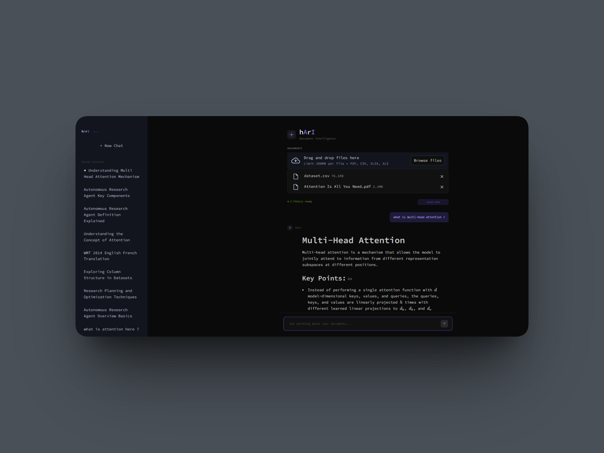
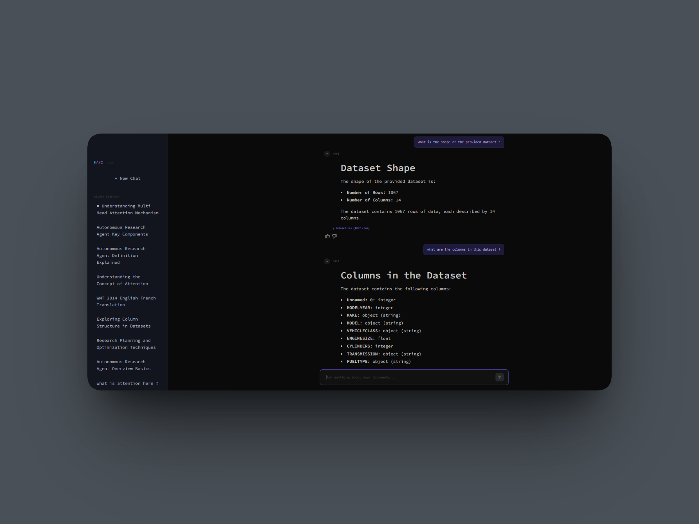
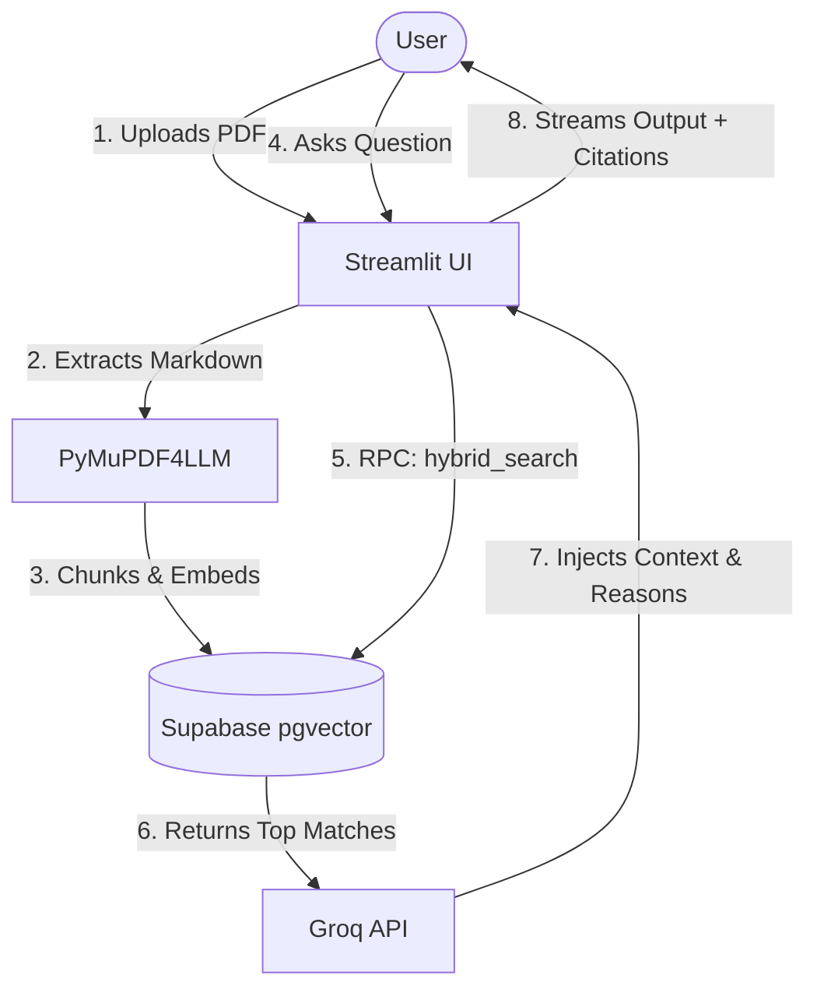
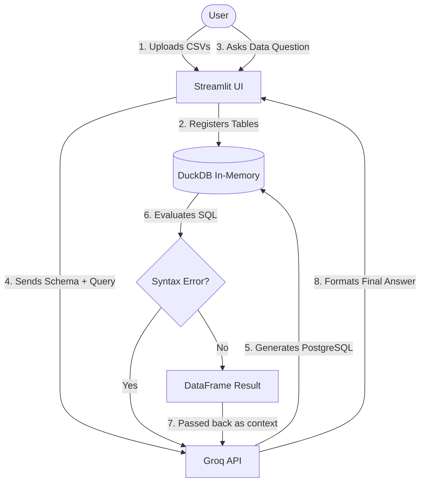

# hArI v2 — Document Intelligence System

> *Talk to your documents. Understand your data.*




hArI is a next-generation AI document intelligence system. Evolving far beyond a standard RAG prototype, hArI v2 features a completely re-engineered architecture. It utilizes **Hybrid Search (Semantic + Keyword)** for perfect PDF retrieval, and an embedded **DuckDB SQL Engine**, secure, multi-table CSV analytics.

---

## 🔥 What's New in v2 

- **DuckDB Analytics Engine** — The insecure Pandas `exec()` approach has been completely removed. CSVs are now securely registered into an in-memory DuckDB connection, allowing Groq to generate and execute pure, safe PostgreSQL.
- **Multi-CSV JOINs** — Upload multiple CSVs simultaneously. hArI will dynamically register all of them into DuckDB, allowing the AI to write complex SQL `JOIN` queries across completely different files.
- **Hybrid Search (`pgvector` + `tsvector`)** — Pure semantic search is dead. hArI now uses a custom Supabase RPC function that mathematically combines vector similarity with exact keyword matching (`ts_rank`). This guarantees significantly reduces hallucination on keyword-heavy queries when searching for highly specific IDs, names, or acronyms.
- **Flawless Markdown Extraction** — PyMuPDF has been upgraded with `pymupdf4llm`. hArI now extracts perfect Markdown from PDFs, perfectly preserving academic tables, headers, and lists for the LLM to read.
- **Citation UI** — Trust, but verify. Every AI answer now includes an interactive drop-down expander showing the exact raw Markdown paragraph retrieved from the database.
- **Production Telemetry** — A built-in 👍/👎 feedback widget logs user satisfaction and queries directly to Supabase for continuous LLM evaluation.
- **Premium UI Aesthetic** — A completely redesigned, premium dark-navy UI tailored via `.streamlit/config.toml` and custom CSS injections.

---

## 🛠️ Technology Stack

| Component | Technology |
|---|---|
| **Frontend UI** | Streamlit (Custom Themed) |
| **Database** | PostgreSQL (Supabase) |
| **Authentication**| Supabase Auth (Email / Magic Link) |
| **Vector Engine** | `pgvector` + `tsvector` (Hybrid Search) |
| **SQL Engine** | DuckDB (In-Memory) |
| **LLM Reasoning** | Groq API (`meta-llama/llama-4-scout-17b-16e-instruct`, `compound-beta-mini`, `llama-3.1-8b-instant`) |
| **PDF Extraction** | `pymupdf4llm` (High-fidelity Markdown) |
| **Embeddings** | `sentence-transformers` (`all-MiniLM-L6-v2`) |

---

## 🏗️ Architecture Flow

### PDF Pipeline (Hybrid RAG)



### CSV Pipeline (Self-Healing SQL)



---

## 🚀 Getting Started

### Prerequisites
- Python 3.10+
- A [Groq API key](https://console.groq.com/)
- A [Supabase](https://supabase.com/) Project (for Postgres + Auth + pgvector)

### Installation
```bash
git clone https://github.com/harshbhanushali26/hArI.git
cd hArI

# Install dependencies (DuckDB, PyMuPDF4LLM, Supabase, etc.)
pip install -r requirements.txt
```

### Environment Setup
Create a `.env` file in the project root:
```env
GROQ_API_KEY=your_groq_key
SUPABASE_URL=your_supabase_url
SUPABASE_KEY=your_supabase_anon_key
```

### 🔐 Authentication & Database Setup
1. **Database Tables:** You must run the provided SQL scripts in your Supabase SQL Editor to initialize the `documents`, `chat_sessions`, `messages`, and `telemetry` tables, as well as the custom `hybrid_search` RPC function.
2. **Email Verification:** By default, Supabase requires **Email Verification** for new accounts. When a user clicks "Sign Up" in the hArI app, they **will not** be able to log in immediately. They must check their inbox for a verification email or Magic Link from Supabase and click it first. *(You can disable "Confirm Email" in the Supabase Dashboard -> Authentication -> Providers -> Email if you want instant login during development).*

### Run
```bash
streamlit run app.py
```

---

## 📊 Telemetry & Evaluation
The system is now wired for production telemetry. User feedback (Thumbs Up/Down) is logged directly to the `telemetry` table in Supabase. The next phase of development includes a standalone `eval.py` script utilizing the **RAGAS** framework to mathematically score hArI's Context Precision and Faithfulness using a Golden Dataset.

---

**Built by [Harsh Bhanushali](https://github.com/harshbhanushali26)**
